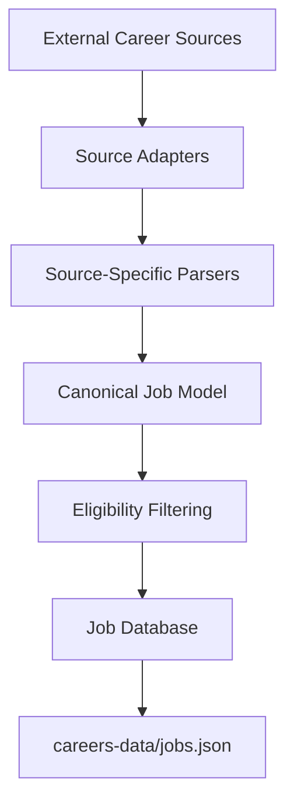
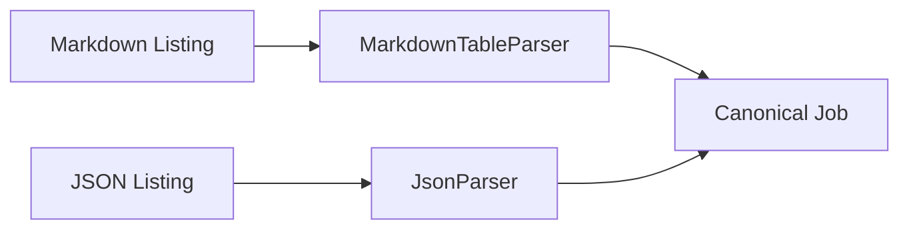
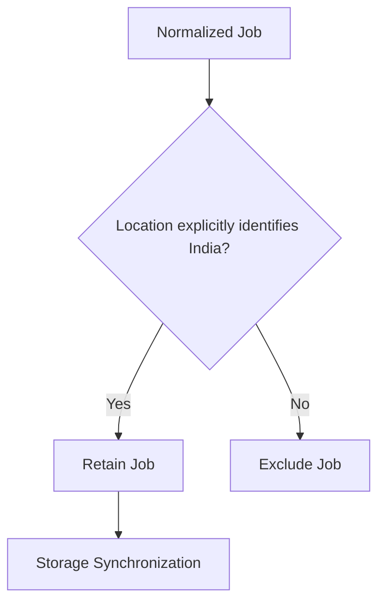
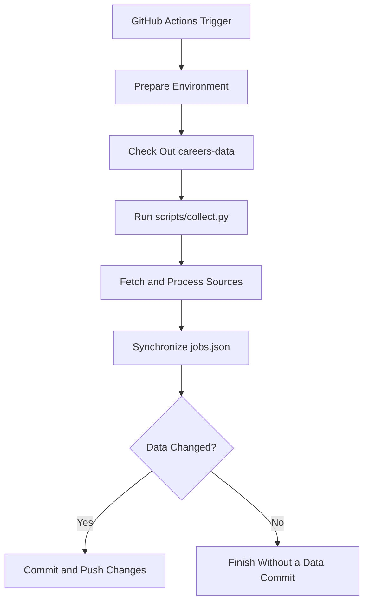

# Ingestion Pipeline

The ingestion pipeline is responsible for transforming career listings from external sources into structured, normalized, and eligible job records.

Different sources expose data in different formats and with different field conventions. Careers Engine isolates these differences behind source adapters and parsers, then processes the resulting records through a common pipeline.

## Pipeline Overview



The pipeline follows a consistent sequence:

1. Fetch listings from supported sources.
2. Parse each source's native data format.
3. Convert listings into the canonical `Job` model.
4. Filter out jobs that do not meet current eligibility criteria.
5. Synchronize eligible jobs with persistent storage.

## 1. Source Adapters

Source adapters encapsulate the logic required to retrieve data from individual upstream sources.

Each adapter knows where its source data is hosted and how to obtain it. This prevents source-specific fetching logic from spreading throughout the application.

Careers Engine currently integrates the following sources:

| Source | Upstream format | Parser |
| --- | --- | --- |
| SpeedyApply | Markdown tables | `MarkdownTableParser` |
| Simplify | JSON | `JsonParser` |

### SpeedyApply

SpeedyApply provides internship and new-graduate listings through Markdown files in the `speedyapply/2027-SWE-College-Jobs` repository.

The source adapter retrieves the supported files, including `INTERN_INTL.md` and `NEW_GRAD_INTL.md`, and passes their contents to the Markdown table parser.

### Simplify

Simplify provides structured internship listings through a JSON dataset maintained in the `SimplifyJobs/Summer2027-Internships` repository.

Its adapter retrieves the dataset and passes the decoded records to `JsonParser`.

Inactive or hidden listings are excluded, and records without a usable location are not admitted into the normalized job collection.

## 2. Parsing and Normalization

Source adapters retrieve data; parsers interpret its structure.

This separation allows the same ingestion pipeline to work with sources that use entirely different representations without coupling downstream components to those formats.

For example, SpeedyApply represents listings as Markdown table rows, while Simplify provides structured JSON objects.

The respective parsers extract the relevant fields and map them into the application's canonical job representation.



### Canonical Job Model

The canonical `Job` model, implemented using Pydantic, defines a consistent representation for jobs regardless of their origin.

Its fields include:

- `company` — company or organization name.
- `role` — job title.
- `location` — stated job location.
- `apply_url` — application link.
- `employment_type` — employment category.
- `eligibility` — optional eligibility information.
- `stipend` — optional compensation information.
- `deadline` — optional application deadline.
- `description` — optional job description.
- `priority` — publication priority.
- `discovered_at` — timestamp recording discovery.

Optional fields allow the pipeline to accommodate differences in the information provided by upstream sources.

**The canonical model acts as the boundary between source-specific data and the rest of the application.** Downstream components operate on normalized `Job` objects rather than needing to understand every source's original format.

## 3. Eligibility Filtering

Not every listing collected from an upstream source is suitable for the intended audience.

After parsing and normalization, the eligibility filter determines which jobs are retained for storage.

The current policy requires an explicit India location. The filter uses a word-boundary-aware match for `India` rather than a broad substring search.

This distinction matters because a substring match could incorrectly classify locations such as `Indianapolis` or `Indiana` as India-eligible.

The current policy also does not treat generic remote listings or listings explicitly associated with other countries as India-eligible merely because they are remote.



Eligibility filtering is deliberately separate from parsing. A parser determines what a listing says; the eligibility filter determines whether that listing meets the application's current inclusion policy.

This policy can evolve independently as the project's target audience and supported regions change.

## 4. Job Identity and Deduplication

Repeated ingestion runs are expected because upstream sources are periodically refreshed. Without deduplication, the same listing could be inserted repeatedly.

Each `Job` exposes a deterministic identifier derived from its company, role, location, and application URL.

The identifier is generated using SHA-256:

```python
key = f"{company}|{role}|{location}|{apply_url}"
identifier = hashlib.sha256(key.encode()).hexdigest()
```

The hash serves as a stable fingerprint for a given combination of these fields. It is not used for encryption.

During database synchronization, existing identifiers are used to determine whether a job is already stored. Jobs that are already known are not treated as new records.

This approach supports idempotent ingestion across repeated runs, provided the identifying fields remain unchanged.

The identifier is based on exact field values, however, so equivalent listings with different URLs or inconsistent metadata may still be recognized as different jobs. Semantic cross-source deduplication is a separate concern.

## 5. Persistence and Data Separation

The ingestion pipeline persists normalized jobs in the separate `careers-data` repository.

The primary data file is:

- `jobs.json` — the collection of known job records.

Separating persistent data from the application repository keeps generated state independent of application code and allows ingestion and publishing workflows to share the same records.

The storage layer is responsible for loading existing records, comparing identifiers, and saving newly discovered jobs when changes occur.

The ingestion pipeline does not publish jobs directly. Its responsibility ends with synchronizing eligible records to persistent storage.

## 6. Automated Execution

GitHub Actions orchestrates ingestion in the deployed environment.

The ingestion workflow supports scheduled execution and manual triggering. It checks out the application, makes the persistent data repository available, and runs the collection script.

The scheduled ingestion interval is six hours.



Changes are committed to the data repository only when the workflow has updates to persist. This avoids creating unnecessary commits when an ingestion run produces no new records.

The separate publishing workflow consumes the stored records and handles delivery to Discord.

## Design Considerations

The ingestion architecture follows several principles:

- **Source isolation:** Each adapter encapsulates upstream retrieval details.
- **Format independence:** Source-specific parsers produce a common data representation.
- **Separation of concerns:** Parsing, eligibility decisions, persistence, and publishing have distinct responsibilities.
- **Repeatability:** Deterministic job identifiers help prevent repeated ingestion from creating duplicate stored records.
- **Extensibility:** Additional sources can be integrated without redesigning the entire pipeline.
- **Persistent-state separation:** Generated job data is maintained independently from application code.

## Failure Boundaries and Limitations

The ingestion pipeline depends on the availability and structure of upstream sources. Changes to their URLs, schemas, or document layouts may require adapter or parser updates.

Eligibility is currently based on explicit location information, so suitable opportunities with missing or ambiguous locations can be excluded.

The current identifier also relies on exact values for four fields; it does not guarantee detection of semantically identical listings with inconsistent metadata.

These limitations define areas for future improvement, including stronger source validation, improved cross-source deduplication, and more detailed source-health monitoring.

## Next step

The ingestion pipeline now has a clear path from external sources to persistent job records.

Continue with the Publishing Pipeline to understand how stored jobs are selected, tracked, formatted, and delivered to Discord.

<Card
  title="Publishing Pipeline"
  icon="arrow-right"
  href="/architecture/publishing-pipeline"
/>
