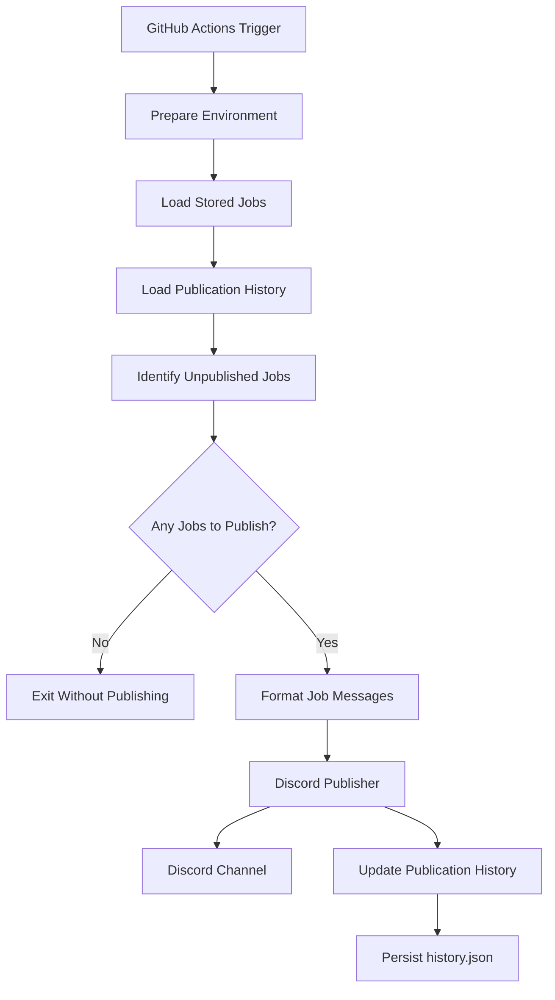
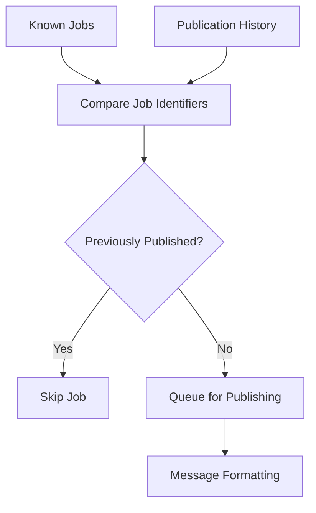
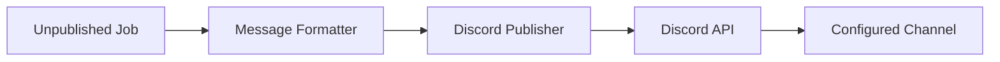
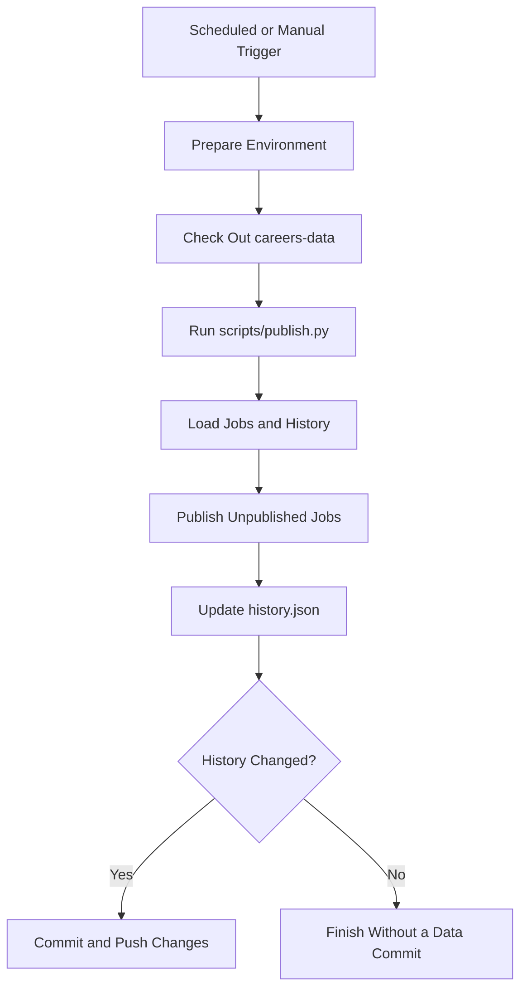

# Publishing Pipeline

The publishing pipeline is responsible for distributing stored career opportunities to configured publishing channels.

It operates independently of ingestion. Rather than fetching and parsing external sources, it consumes the normalized job records maintained by the ingestion pipeline, identifies jobs that have not yet been published, formats them for delivery, and updates publication history.

Discord is the current publishing destination.

## Pipeline Overview

The publishing pipeline follows these steps:

1. Load normalized jobs from persistent storage.
2. Read the existing publication history.
3. Identify jobs that have not already been published.
4. Format eligible jobs for the destination channel.
5. Send the formatted messages through the Discord bot.
6. Update and persist publication history.

## 1. Input Data

The publisher consumes two persistent data files from the `careers-data` repository.

| File | Responsibility |
| --- | --- |
| `jobs.json` | Contains the known normalized job records produced by ingestion. |
| `history.json` | Tracks publication state so previously published jobs are not repeatedly selected. |

Keeping job data separate from publication history allows the system to distinguish between **discovering a job** and **publishing a job**.

A job may already exist in `jobs.json` without having been published. The publishing pipeline uses the history records to determine which jobs still need distribution.

## 2. Selecting Unpublished Jobs

Before sending messages, the publishing pipeline compares known jobs against the existing publication history.

The job identifier generated by the canonical `Job` model provides the basis for matching records across runs.

This check makes repeated publishing runs idempotent under normal operating conditions: jobs already recorded as published are not selected again.

If no unpublished jobs are found, the pipeline exits without sending messages or making unnecessary publication-history changes.

### Publication History

The history file maintains the state needed to distinguish published jobs from jobs awaiting publication.

After a successful publication, the corresponding job is recorded in the history so subsequent runs can recognize it.

This state is essential because ingestion and publishing run independently. New jobs can be collected between publishing runs, while previously discovered jobs remain in storage.

## 3. Message Formatting

Normalized job records are designed for consistent application-level processing, not necessarily for direct presentation to users.

Before delivery, the publisher transforms each selected job into a Discord-compatible message.

The message can use the available job metadata, such as:

- Company name.
- Job title.
- Location.
- Application URL.
- Other optional metadata supported by the formatter.

Formatting is kept separate from source parsing. This means the publisher does not need to know whether a job originally came from a Markdown table or a JSON dataset.

As additional publishing channels are introduced, each channel can define its own presentation without requiring upstream parsers to change.

## 4. Discord Delivery

The current publisher uses `discord.py` to interact with the Discord API.

The destination is configured through the application's environment, including the Discord bot token and target channel ID.

The bot must have the required channel permissions to send the formatted opportunities.

Discord acts as the delivery layer rather than the source of truth for job records. The canonical job data remains in `careers-data`, independently of the messages sent to the channel.

This separation allows publishing to be rerun without requiring the application to recollect every upstream listing.

## 5. Persisting Publication State

Publication history must reflect actual delivery, not merely an attempt to send a message.

After a job is successfully published, its publication state is recorded and persisted to `history.json`.

This allows later runs to skip it and focus on jobs that have not yet been distributed.

If no publication state changes, the workflow avoids unnecessary data commits.

The publishing process therefore maintains two distinct kinds of state:

- **Job state:** which opportunities the system knows about.
- **Publication state:** which opportunities have been distributed.

This distinction prevents the ingestion pipeline from being coupled to Discord delivery.

## 6. Automated Execution

GitHub Actions orchestrates the publishing workflow.

The workflow supports scheduled execution and manual triggering. It prepares the environment, checks out the persistent data repository, and executes `scripts/publish.py`.

Publishing is scheduled every six hours, with a ten-minute offset from the ingestion schedule. This reduces the chance of both workflows attempting to update the shared data repository simultaneously.

The ingestion and publishing workflows are separate:

- **Ingestion** discovers and persists new eligible jobs.
- **Publishing** distributes unpublished stored jobs and records publication state.

This separation allows either workflow to be run independently when needed.

## Design Considerations

The publishing architecture follows several principles:

- **Separation of responsibilities:** Collection and delivery are handled by different pipelines.
- **Stateful deduplication:** Publication history prevents previously recorded jobs from being repeatedly selected.
- **Destination abstraction:** Message formatting and publishing are distinct from source-specific parsing.
- **Repeatable execution:** Scheduled and manual runs use the same publishing entry point.
- **Persistent state:** Publication history survives across workflow executions through the separate data repository.
- **Change-aware persistence:** The workflow commits updated history only when changes need to be saved.

## Failure Boundaries and Limitations

Publishing depends on Discord availability, valid credentials, correct channel configuration, and sufficient bot permissions.

A delivery failure must not be treated as a successful publication. Publication history should only advance when delivery succeeds, otherwise a later run may incorrectly skip a job that was never delivered.

The current history-based design also depends on stable job identifiers. Changes to a job's identifying fields can cause it to be treated as a different record.

As the system grows, possible improvements include more robust retry handling, explicit delivery-state transitions, rate-limit handling, and additional publishers.

## Next step

Continue with Storage Architecture to understand how job records and publication history are persisted and shared between the two pipelines.

<Card
  title="Storage Architecture"
  icon="arrow-right"
  href="/architecture/storage"
/>
