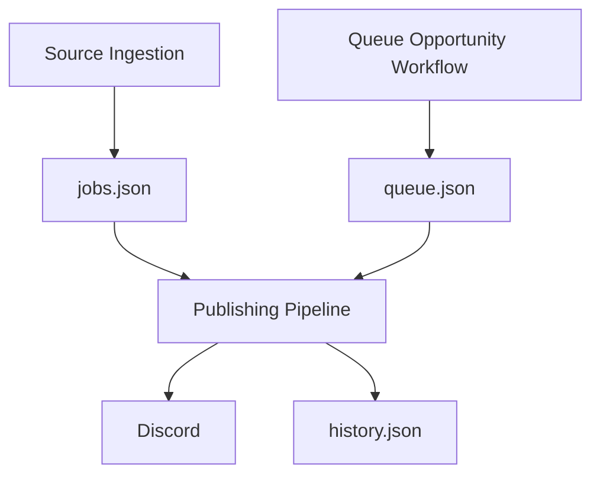

# Storage

Careers Engine separates application logic from persistent data. Its operational state is maintained in a dedicated [`careers-data`](https://github.com/ZenYukti/careers-data) repository, independently of the main [`careers-engine`](https://github.com/ZenYukti/careers-engine) repository.

The storage layer currently uses JSON files to preserve state across workflow executions. Each file serves a distinct purpose: maintaining known opportunities, tracking publication history, or holding opportunities submitted through the manual queue.

## Storage Layout

The current storage layer uses three primary files.

| File | Responsibility |
| --- | --- |
| `jobs.json` | Stores normalized career opportunities collected by the ingestion pipeline. |
| `history.json` | Tracks publication history so previously published opportunities can be recognized. |
| `queue.json` | Stores manually submitted opportunities awaiting processing through the Queue Opportunity workflow. |

These files represent different parts of the system's state and are not interchangeable.

## How Storage Fits into the System



The ingestion pipeline populates the known-job collection, while the Queue Opportunity workflow provides a separate path for manually submitted opportunities. The publishing pipeline uses the relevant stored state to distribute opportunities and maintain publication history.

For more detail, see the [Ingestion Pipeline](/architecture/ingestion-pipeline) and [Publishing Pipeline](/architecture/publishing-pipeline).

## Job Records — `jobs.json`

`jobs.json` contains normalized job records produced by automated ingestion.

Source adapters and parsers convert upstream listings into the canonical `Job` model before the records are persisted. This allows the application to process opportunities consistently regardless of whether they originated from Markdown tables or JSON datasets.

The storage layer loads existing records, checks incoming jobs against known identifiers, and persists changes when new records are discovered.

Each job receives a deterministic SHA-256 identifier derived from its company, role, location, and application URL. This identifier supports duplicate detection across ingestion runs, provided those fields remain unchanged.

See the [Ingestion Pipeline](/architecture/ingestion-pipeline) for the complete data flow and normalization process.

## Publication History — `history.json`

`history.json` maintains the state used by the publishing pipeline to identify previously published opportunities.

A job may exist in `jobs.json` without having been published. The publisher compares known job identifiers against publication history to determine which opportunities still need distribution.

Separating publication history from job records means that discovering an opportunity and distributing it are treated as distinct operations.

This separation also allows scheduled publishing runs to avoid repeatedly selecting jobs already recorded as published.

See the [Publishing Pipeline](/architecture/publishing-pipeline) for the publication lifecycle.

## Manual Opportunity Queue — `queue.json`

Not every opportunity necessarily originates from an automated source. Careers Engine also supports a manual submission path through the **Queue Opportunity workflow**.

`queue.json` stores manually submitted opportunities for this workflow. It provides a place for manually supplied listings to enter the system without requiring an upstream source adapter to be implemented for each opportunity.

This complements automated ingestion:

- **Automated ingestion** retrieves listings from supported external sources.
- **Manual queuing** allows opportunities to be submitted explicitly through the queue workflow.
- **Publishing** distributes opportunities through the configured publishing mechanism.

The queue is a distinct input path, not a replacement for `jobs.json` or `history.json`.

The exact queue-processing and removal behavior is determined by the Queue Opportunity workflow implementation; the presence of `queue.json` alone does not imply that every queued item has already been published.

## Repository Separation

Careers Engine uses separate repositories for application code and persistent operational data.

| Repository | Contents |
| --- | --- |
| [`careers-engine`](https://github.com/ZenYukti/careers-engine) | Source adapters, parsers, filters, data models, storage logic, publishers, tests, documentation, and GitHub Actions workflows. |
| [`careers-data`](https://github.com/ZenYukti/careers-data) | Persistent JSON state, including job records, publication history, and the manual opportunity queue. |

The application repository defines how data is processed; the data repository preserves state between executions.

GitHub Actions checks out the data repository when a workflow needs to read or update persistent state. When changes need to be saved, the workflow commits and pushes the updated files.

This provides persistence across otherwise isolated workflow runs without requiring a continuously running database server.

## Configuration

The storage directory is controlled by the `DATA_DIR` environment variable.

```python
DATA_DIR = Path(os.environ.get("DATA_DIR", "data"))

JOBS_FILE = DATA_DIR / "jobs.json"
HISTORY_FILE = DATA_DIR / "history.json"
QUEUE_FILE = DATA_DIR / "queue.json"
```

When `DATA_DIR` is not configured, the application defaults to a local `data` directory. Deployment workflows can point it to the checked-out `careers-data` repository.

Keeping file paths derived from a single configuration value allows local development and automated execution to use different storage locations without changing application logic.

For setup instructions, see [Configuration](/getting-started/configuration) and [GitHub Actions](/getting-started/github-actions).

## Why JSON and Git-Based Persistence?

The current approach keeps the infrastructure relatively simple for the project's workload.

- **Straightforward representation:** Job records and workflow state can be stored as JSON.
- **Low operational overhead:** No separate database service is required.
- **Version history:** Git records changes to persistent data.
- **Workflow compatibility:** GitHub Actions can load, update, and commit state during scheduled or manual executions.
- **Separation of concerns:** Application code and generated operational state are managed independently.

These are trade-offs suited to the current implementation, not a claim that JSON is optimal for every scale.

## Limitations and Future Considerations

The storage design has several constraints:

- Concurrent workflows can contend when pushing changes to the same data repository.
- JSON files are less suitable for complex queries and large datasets than a database.
- Git-based persistence does not provide database transactions.
- Exact-field identifiers may fail to recognize semantically identical listings with inconsistent metadata.
- Publication history must remain consistent with actual delivery outcomes.
- Queue processing must handle failures and state transitions carefully to avoid losing or repeatedly processing manually submitted opportunities.

If the system's workload grows, possible improvements include stronger concurrency control, transactional persistence, more sophisticated deduplication, and a database backend such as PostgreSQL.

## Next step

Storage provides the persistent state shared by automated ingestion, manual submissions, and publishing.

Continue with Company Branding to understand how company identity and branding information are handled across job opportunities.

<Card
  title="Company Branding"
  icon="arrow-right"
  href="/architecture/company-branding"
/>
